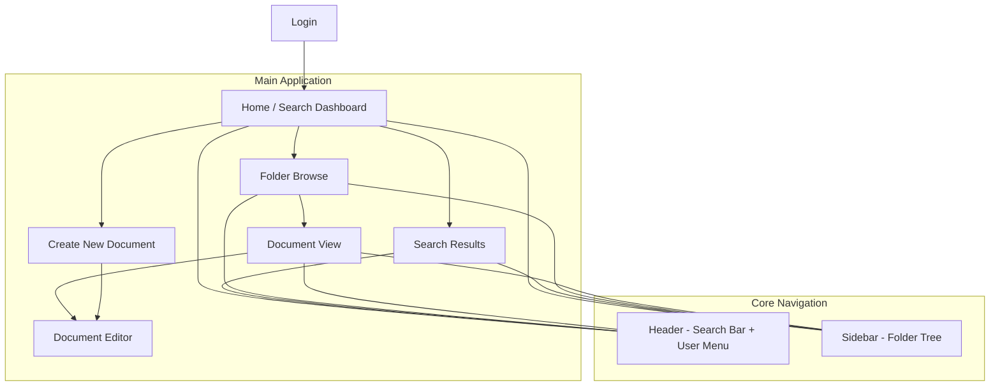
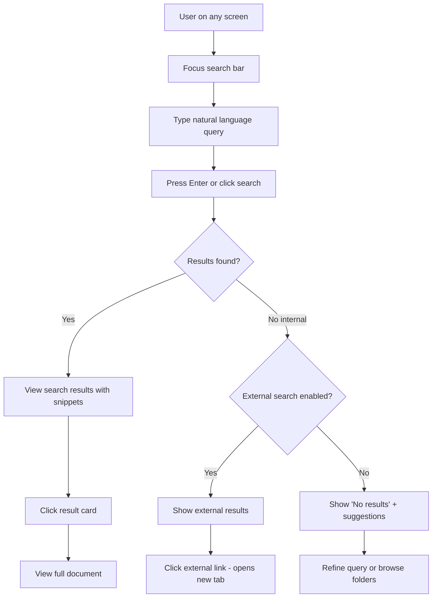
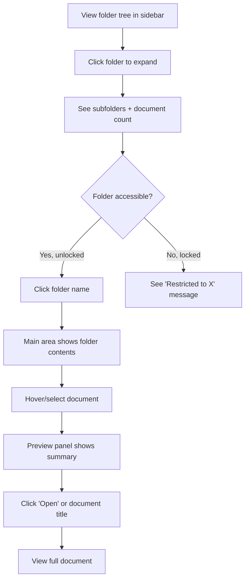
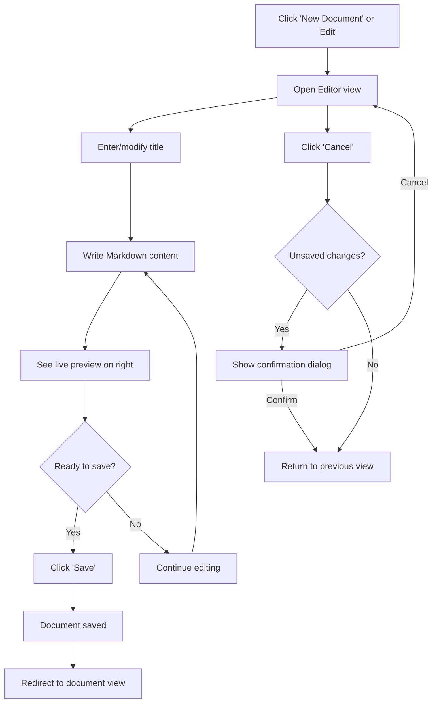
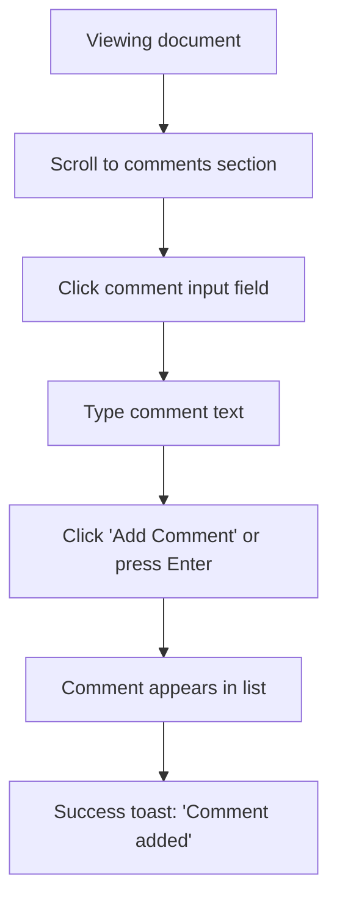
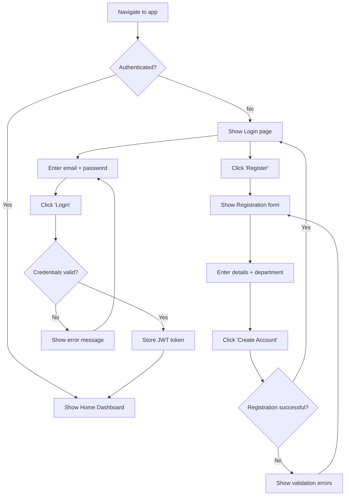

# SimpleConf UI/UX Specification

## Introduction

This document defines the user experience goals, information architecture, user flows, and visual design specifications for **SimpleConf's** user interface. It serves as the foundation for visual design and frontend development, ensuring a cohesive and user-centered experience.

### Overall UX Goals & Principles

#### Target User Personas

| Persona | Description |
|---------|-------------|
| **Developer (Primary)** | Frontend, Backend, and Flutter engineers who need quick access to PRDs, technical specs, and integration guides. Values efficiency over features. Searches first, browses second. Frustrated by context-switching to ask colleagues "where is the doc for X?" |
| **Business User (Secondary)** | Sales, Accounts, and HR team members who create and manage business documentation. Need secure storage with clear access control. Less technical, prefer simple interfaces over developer-centric tools. Want visibility into who accesses their docs. |
| **New Hire** | Recently onboarded team member who doesn't know "where things are." Needs self-serve discovery to become productive without constant colleague interruptions. Benefits most from natural language querying. |

#### Usability Goals

- **Ease of discovery:** Users find relevant documents through natural language queries 70%+ of the time on first attempt
- **Time to value:** Query-to-result under 10 seconds; new users complete first successful query within 2 minutes
- **Reduced friction:** Users find what they need without asking colleagues (measurable via reduced "where is X" Slack messages)
- **Clear access signals:** Users immediately understand what they can/cannot access without trial-and-error clicking
- **Lightweight engagement:** Adding comments takes one click, no modal dialogs or formatting decisions

#### Design Principles

1. **Search-first, always** — The query bar is the hero; every page keeps it prominent and accessible (Cmd/Ctrl+K from anywhere)
2. **Progressive disclosure** — Show structure at a glance; reveal details on demand (folder → preview → full doc)
3. **Clarity over cleverness** — Prioritize clear communication over aesthetic innovation; no mystery meat navigation
4. **Visual access signals** — Lock/unlock icons provide instant clarity on permissions; no 403 surprises
5. **Lightweight engagement** — Comments and view counts add life without social complexity; no threads, no reactions

### Change Log

| Date | Version | Description | Author |
|------|---------|-------------|--------|
| 2024-12-18 | 1.0 | Initial UI/UX Specification | Sally (UX Expert) |

---

## Information Architecture (IA)

### Site Map / Screen Inventory



### Navigation Structure

**Primary Navigation:** Persistent search bar in header (always visible, Cmd/Ctrl+K shortcut). This is the primary entry point for document discovery.

**Secondary Navigation:** Collapsible folder tree in left sidebar. Provides visual browsing alternative when users prefer exploration over search. Shows hierarchical structure with access indicators.

**Breadcrumb Strategy:** Displayed above document content showing full path: `Home > [Department] > [Folder] > [Document Title]`. Clickable at each level. Not shown on Home/Search Dashboard.

---

## User Flows

### Flow 1: Natural Language Search (Primary Flow)

**User Goal:** Find a document by asking a question in plain English

**Entry Points:**
- Search bar in header (always visible)
- Keyboard shortcut Cmd/Ctrl+K from any screen
- Home page hero search bar

**Success Criteria:** User finds relevant document and opens it within 3 interactions



**Edge Cases & Error Handling:**
- Empty query: Show recent searches dropdown instead of triggering search
- Query too short (<3 chars): Show hint "Try a more specific question"
- Search timeout: Show "Search is taking longer than usual..." with retry option
- No access to result: Show result but indicate "Restricted to [Department]" with lock icon

**Notes:** Search should feel conversational. Placeholder text rotates through examples: "How do I integrate Razorpay?", "Find PRDs for e-commerce projects", "Payment gateway documentation"

---

### Flow 2: Folder Browsing

**User Goal:** Explore available documentation by navigating the folder hierarchy

**Entry Points:**
- Sidebar folder tree (always visible when logged in)
- Breadcrumb navigation from document view

**Success Criteria:** User locates and opens a document through visual navigation



**Edge Cases & Error Handling:**
- Empty folder: Show "No documents yet" with "Create Document" button (if user has write access)
- Deeply nested folders (>4 levels): Consider flattening or showing full path in preview
- Folder with many documents (>50): Implement pagination or "Show more" pattern

---

### Flow 3: Document Creation & Editing

**User Goal:** Create a new document or edit an existing one

**Entry Points:**
- "New Document" button in folder view
- "Edit" button on document view (owner only)
- Empty folder "Create Document" CTA

**Success Criteria:** User successfully saves document content



**Edge Cases & Error Handling:**
- Empty title: Disable save button, show inline validation "Title required"
- Network error on save: Show error toast with "Retry" option, preserve content in editor
- Session expired during edit: Show re-login modal, preserve content locally
- Concurrent edit (future): For MVP, last-write-wins; show warning if document was modified

---

### Flow 4: Adding a Comment

**User Goal:** Add feedback or context to a document

**Entry Points:** Comment section below document content

**Success Criteria:** Comment appears in chronological list



**Edge Cases & Error Handling:**
- Empty comment: Disable submit button
- Very long comment (>2000 chars): Show character count, truncate or warn
- Network error: Show "Failed to add comment" with retry
- Deleted comment: Remove from list immediately, show undo toast (5 seconds)

---

### Flow 5: Login & Authentication

**User Goal:** Securely access the knowledge base

**Entry Points:** Login page (redirect from any protected route)

**Success Criteria:** User reaches Home/Search Dashboard



**Edge Cases & Error Handling:**
- Invalid email format: Inline validation before submit
- Wrong password: Generic "Invalid credentials" (don't reveal if email exists)
- Account locked (future): Show lockout message with support contact
- Network error: "Unable to connect. Check your connection."

---

## Wireframes & Mockups

**Primary Design Files:** To be created in Figma

### Key Screen Layouts

#### Screen 1: Home / Search Dashboard

**Purpose:** Primary landing page emphasizing search-first discovery with quick access to recent and popular content.

**Key Elements:**
- Hero search bar (large, centered, with placeholder examples)
- Recent searches dropdown (last 5, stored locally)
- Popular documents section (top 5 by view count)
- Folder tree in collapsible left sidebar
- User menu in top-right header

**Interaction Notes:** Search bar auto-focuses on page load. Cmd/Ctrl+K focuses search from anywhere. Recent searches appear on focus before typing.

**Layout:**
```
+----------------------------------------------------------+
|  [Logo]        [========== Search Bar ==========]  [User] |
+----------------------------------------------------------+
|           |                                               |
|  Folder   |     "What are you looking for?"               |
|  Tree     |     [====== Hero Search Input ======]         |
|           |                                               |
|  > Dept1  |     Recent Searches          Popular Docs     |
|  > Dept2  |     - query 1                - Doc Title 1    |
|  > Dept3  |     - query 2                - Doc Title 2    |
|           |     - query 3                - Doc Title 3    |
+----------------------------------------------------------+
```

---

#### Screen 2: Search Results

**Purpose:** Display documents matching the natural language query with context snippets.

**Key Elements:**
- Persistent search bar (with current query)
- Result count and toggle for internal/external search
- Result cards showing: title, folder path, snippet with highlights, view count
- External results section (visually distinct)

**Interaction Notes:** Results load progressively. Clicking a card navigates to document. External links open in new tab.

**Layout:**
```
+----------------------------------------------------------+
|  [Logo]        [===== Search: "razorpay" =====]    [User] |
+----------------------------------------------------------+
|           |  12 results found    [Internal] [Everywhere]  |
|  Folder   |                                               |
|  Tree     |  +------------------------------------------+ |
|           |  | Razorpay Integration Guide      47 views | |
|           |  | Sales > Payment Gateways                 | |
|           |  | "...configure the Razorpay checkout..."  | |
|           |  +------------------------------------------+ |
|           |                                               |
|           |  +------------------------------------------+ |
|           |  | E-commerce Payment PRD          23 views | |
|           |  | Product > E-commerce                     | |
|           |  | "...supports Razorpay, PhonePe..."       | |
|           |  +------------------------------------------+ |
+----------------------------------------------------------+
```

---

#### Screen 3: Folder Browse View

**Purpose:** Display folder contents with document preview panel for progressive disclosure.

**Key Elements:**
- Breadcrumb navigation
- Folder header with name and document count
- Document list (title, last updated, owner)
- Preview panel on document hover/selection
- "New Document" button (if write access)

**Interaction Notes:** Clicking folder in tree updates main area. Hovering document shows preview. Double-click or "Open" button navigates to full doc.

**Layout:**
```
+----------------------------------------------------------+
|  [Logo]        [========== Search Bar ==========]  [User] |
+----------------------------------------------------------+
|           |  Home > Sales > Payment Gateways              |
|  Folder   |  Payment Gateways (7 documents)    [+ New]    |
|  Tree     |  +-----------------------+  +---------------+ |
|           |  | Razorpay Guide   [>]  |  | Preview Panel | |
|  > Dept1  |  | Updated 2 days ago    |  | Title: ...    | |
|    > Sub  |  +-----------------------+  | Summary: ...  | |
|  > Dept2  |  | PhonePe Integration   |  | Owner: ...    | |
|  > Dept3  |  | Updated 1 week ago    |  | Views: 47     | |
|           |  +-----------------------+  | [Open]        | |
|           |  | Stripe Setup          |  +---------------+ |
+----------------------------------------------------------+
```

---

#### Screen 4: Document View

**Purpose:** Display full document content with metadata and engagement features.

**Key Elements:**
- Breadcrumb navigation
- Document title (H1)
- Metadata bar: Created by, Modified by, Last updated, View count, Comment count
- Rendered Markdown content with syntax highlighting
- Edit button (owner only)
- Comments section below content

**Interaction Notes:** View count increments on load (deduplicated per session). Edit button opens editor. Comments load below fold.

**Layout:**
```
+----------------------------------------------------------+
|  [Logo]        [========== Search Bar ==========]  [User] |
+----------------------------------------------------------+
|           |  Home > Sales > Payment Gateways > Razorpay   |
|  Folder   |                                               |
|  Tree     |  # Razorpay Integration Guide        [Edit]   |
|           |  Created by: John | Modified: Jane | 2h ago   |
|           |  47 views | 12 comments                       |
|           |  -----------------------------------------    |
|           |                                               |
|           |  ## Overview                                  |
|           |  This guide covers the integration of...      |
|           |                                               |
|           |  ```javascript                                |
|           |  const razorpay = new Razorpay({...})         |
|           |  ```                                          |
|           |                                               |
|           |  -----------------------------------------    |
|           |  ## Comments (12)                             |
|           |  [Add a comment...]                           |
|           |  Jane, 2h ago: "Great doc!"                   |
+----------------------------------------------------------+
```

---

#### Screen 5: Document Editor

**Purpose:** Create or edit Markdown documents with live preview.

**Key Elements:**
- Title input field
- Split view: Markdown editor (left), Live preview (right)
- Toolbar with common Markdown shortcuts (bold, italic, code, link)
- Save and Cancel buttons
- Unsaved changes indicator

**Interaction Notes:** Live preview updates on keystroke (debounced). Tab key inserts spaces, not focus change. Cmd/Ctrl+S saves.

**Layout:**
```
+----------------------------------------------------------+
|  [Logo]        [========== Search Bar ==========]  [User] |
+----------------------------------------------------------+
|           |  [Cancel]   Edit Document            [Save]   |
|  Folder   |                                               |
|  Tree     |  Title: [Razorpay Integration Guide_______]   |
|           |  +------------------------+------------------+ |
|           |  | # Markdown Editor      | # Live Preview   | |
|           |  |                        |                  | |
|           |  | ## Overview            | ## Overview      | |
|           |  | This guide covers the  | This guide...    | |
|           |  | integration of...      |                  | |
|           |  |                        | ```javascript    | |
|           |  | ```javascript          | const razorpay   | |
|           |  | const razorpay = ...   | ```              | |
|           |  | ```                    |                  | |
|           |  +------------------------+------------------+ |
+----------------------------------------------------------+
```

---

#### Screen 6: Login / Registration

**Purpose:** Authenticate users to access the knowledge base.

**Key Elements:**
- SimpleConf logo and tagline
- Email and password inputs
- Login button
- Link to registration form
- Error message display area

**Interaction Notes:** Email validated on blur. Password shows/hide toggle. Enter key submits form. Auto-focus on email field.

**Layout:**
```
+----------------------------------------------------------+
|                                                           |
|                    [SimpleConf Logo]                      |
|              "Find knowledge, not folders"                |
|                                                           |
|              +---------------------------+                |
|              |  Email                    |                |
|              |  [_____________________]  |                |
|              |                           |                |
|              |  Password           [Eye] |                |
|              |  [_____________________]  |                |
|              |                           |                |
|              |  [      Login         ]   |                |
|              |                           |                |
|              |  Don't have an account?   |                |
|              |  [Register]               |                |
|              +---------------------------+                |
|                                                           |
+----------------------------------------------------------+
```

---

## Component Library / Design System

**Design System Approach:** Leverage shadcn/ui (Radix primitives + Tailwind CSS) as the foundation. This provides accessible, unstyled primitives that we customize to match SimpleConf's visual identity. Benefits: zero runtime overhead, full customization control, WCAG compliance built-in.

### Core Components

#### Search Bar

**Purpose:** Primary search input for natural language queries

**Variants:**
- Hero (large, centered on home page)
- Header (compact, persistent in navigation)

**States:** Default, Focused, Loading, With Results Dropdown

**Usage Guidelines:** Always visible in header. Hero variant only on home page. Shows recent searches on focus. Loading spinner replaces search icon during query.

---

#### Folder Tree

**Purpose:** Hierarchical navigation of document structure

**Variants:**
- Expanded (default sidebar)
- Collapsed (icon-only mode)

**States:** Default, Hover, Selected, Expanded, Collapsed

**Usage Guidelines:** Root folders show department names. Indent nested folders. Show document count badge. Use 🔓/🔒 icons for access indication. Muted opacity for restricted folders.

---

#### Document Card

**Purpose:** Display document summary in lists and search results

**Variants:**
- List item (folder view)
- Search result (with snippet highlighting)

**States:** Default, Hover, Selected, Restricted

**Usage Guidelines:** Show title prominently. Include folder path as breadcrumb. Display metadata (views, date) in muted text. Highlight query matches in search results.

---

#### Preview Panel

**Purpose:** Show document summary before committing to full view

**Variants:** Single variant (slide-in panel)

**States:** Hidden, Visible, Loading

**Usage Guidelines:** Appears on document hover/selection in folder view. Shows title, first 200 chars, metadata. Include "Open" CTA button.

---

#### Metadata Bar

**Purpose:** Display document authorship and engagement metrics

**Variants:** Single variant

**States:** Default only

**Usage Guidelines:** Horizontal layout below title. Show: Created by, Modified by, Relative timestamp, View count badge, Comment count badge. Use subtle separators.

---

#### Comment

**Purpose:** Display user feedback on documents

**Variants:**
- Comment item (in list)
- Comment input (add new)

**States:** Default, Hover (for delete action), Deleting

**Usage Guidelines:** Chronological order, newest at bottom. Show author name, relative timestamp, content. Delete button visible on hover (author only). No threading or reactions.

---

#### Button

**Purpose:** Trigger actions throughout the application

**Variants:**
- Primary (filled, high emphasis)
- Secondary (outlined, medium emphasis)
- Ghost (text only, low emphasis)
- Icon (icon-only, compact)

**States:** Default, Hover, Active, Disabled, Loading

**Usage Guidelines:** Primary for main CTAs (Save, Login, Search). Secondary for alternatives (Cancel, Register). Ghost for inline actions. Icon for toolbar actions.

---

#### Access Indicator

**Purpose:** Visually communicate document/folder permissions

**Variants:**
- Unlocked (🔓 - accessible)
- Locked (🔒 - restricted)

**States:** Default only

**Usage Guidelines:** Display inline with folder/document name. Locked items show at reduced opacity. Tooltip explains restriction ("Restricted to Sales team").

---

## Branding & Style Guide

### Visual Identity

**Brand Guidelines:** SimpleConf adopts a clean, professional, developer-friendly aesthetic inspired by modern documentation tools (Notion, GitBook, Stripe Docs). The visual language emphasizes clarity, readability, and efficiency.

### Color Palette

| Color Type | Hex Code | Usage |
|------------|----------|-------|
| Primary | `#2563EB` (Blue 600) | Primary actions, links, focus states |
| Secondary | `#475569` (Slate 600) | Secondary text, icons |
| Accent | `#8B5CF6` (Violet 500) | Highlights, search match emphasis |
| Success | `#16A34A` (Green 600) | Positive feedback, save confirmations |
| Warning | `#CA8A04` (Yellow 600) | Cautions, important notices |
| Error | `#DC2626` (Red 600) | Errors, destructive actions, validation |
| Neutral | `#F8FAFC` to `#0F172A` (Slate scale) | Text, borders, backgrounds |

**Background Hierarchy:**
- Page background: `#FFFFFF` (White)
- Sidebar background: `#F8FAFC` (Slate 50)
- Card/Panel background: `#FFFFFF` with subtle border
- Code block background: `#1E293B` (Slate 800)

### Typography

#### Font Families

- **Primary:** Inter (headings, body text) - clean, highly legible, excellent for UI
- **Secondary:** Inter (consistent throughout)
- **Monospace:** JetBrains Mono (code blocks, technical content)

#### Type Scale

| Element | Size | Weight | Line Height |
|---------|------|--------|-------------|
| H1 | 2rem (32px) | 700 (Bold) | 1.25 |
| H2 | 1.5rem (24px) | 600 (Semibold) | 1.33 |
| H3 | 1.25rem (20px) | 600 (Semibold) | 1.4 |
| Body | 1rem (16px) | 400 (Regular) | 1.5 |
| Small | 0.875rem (14px) | 400 (Regular) | 1.43 |

### Iconography

**Icon Library:** Lucide Icons (consistent with shadcn/ui ecosystem)

**Usage Guidelines:**
- 20px default size for inline icons
- 24px for navigation and primary actions
- Stroke width: 2px
- Use semantic icons: Search (magnifying glass), Folder, File, Lock, Unlock, Eye (views), MessageSquare (comments)

### Spacing & Layout

**Grid System:** 12-column grid with 24px gutters for main content area. Sidebar fixed at 280px (collapsible to 64px).

**Spacing Scale:** Based on 4px baseline unit
- `xs`: 4px
- `sm`: 8px
- `md`: 16px
- `lg`: 24px
- `xl`: 32px
- `2xl`: 48px

---

## Accessibility Requirements

### Compliance Target

**Standard:** WCAG 2.1 Level AA

### Key Requirements

**Visual:**
- Color contrast ratios: Minimum 4.5:1 for normal text, 3:1 for large text and UI components
- Focus indicators: Visible 2px outline on all interactive elements using primary color
- Text sizing: Base 16px, scalable up to 200% without horizontal scrolling

**Interaction:**
- Keyboard navigation: Full app navigable via Tab, Enter, Escape, Arrow keys
- Screen reader support: Semantic HTML, ARIA labels for icons, live regions for dynamic content
- Touch targets: Minimum 44x44px for all interactive elements

**Content:**
- Alternative text: All meaningful images and icons have descriptive alt text or aria-labels
- Heading structure: Single H1 per page, logical H2-H6 hierarchy, no skipped levels
- Form labels: All inputs have visible labels or aria-labelledby; error messages linked to inputs

### Testing Strategy

- Automated: axe-core integration in CI/CD pipeline
- Manual: Keyboard-only navigation testing for all user flows
- Screen reader: VoiceOver (macOS) and NVDA (Windows) testing for core flows
- Color contrast: Verified with WebAIM contrast checker

---

## Responsiveness Strategy

### Breakpoints

| Breakpoint | Min Width | Max Width | Target Devices |
|------------|-----------|-----------|----------------|
| Mobile | 320px | 639px | Phones (not optimized, basic support) |
| Tablet | 640px | 1023px | Tablets, small laptops |
| Desktop | 1024px | 1439px | Standard desktop monitors |
| Wide | 1440px | - | Large monitors, ultrawide |

### Adaptation Patterns

**Layout Changes:**
- Mobile: Stack layout, hide sidebar, full-width content
- Tablet: Collapsible sidebar, narrower preview panel
- Desktop: Three-column layout (sidebar + content + preview)
- Wide: Max-width container (1400px) with centered content

**Navigation Changes:**
- Mobile: Hamburger menu for sidebar, bottom search bar
- Tablet: Collapsible sidebar toggle in header
- Desktop+: Persistent sidebar, always-visible search

**Content Priority:**
- Mobile: Search bar, document content, comments (folder tree hidden)
- Tablet: Search bar, sidebar, document content
- Desktop: Full experience with all panels

**Interaction Changes:**
- Mobile: Tap to select, no hover states, bottom sheet for preview
- Tablet: Touch + limited hover support
- Desktop: Full hover interactions, keyboard shortcuts

---

## Animation & Micro-interactions

### Motion Principles

1. **Purposeful motion** — Animation serves function (feedback, guidance, continuity), never decoration
2. **Quick and subtle** — Animations complete in 150-300ms; users shouldn't wait for animations
3. **Respect preferences** — Honor `prefers-reduced-motion` media query by disabling non-essential animations
4. **Consistent easing** — Use ease-out for entrances, ease-in for exits, ease-in-out for transitions

### Key Animations

- **Search results loading:** Skeleton placeholders pulse while loading (Duration: 1000ms loop, Easing: ease-in-out)
- **Folder expand/collapse:** Smooth height transition with chevron rotation (Duration: 200ms, Easing: ease-out)
- **Preview panel slide-in:** Horizontal slide from right edge (Duration: 200ms, Easing: ease-out)
- **Button hover:** Subtle background color shift (Duration: 150ms, Easing: ease-out)
- **Toast notification:** Slide up from bottom + fade in (Duration: 300ms, Easing: ease-out)
- **Focus ring:** Instant appearance, no transition (accessibility requirement)

---

## Performance Considerations

### Performance Goals

- **Page Load:** First Contentful Paint (FCP) under 1.5 seconds on 4G connection
- **Interaction Response:** Time to Interactive (TTI) under 3 seconds; input latency under 100ms
- **Animation FPS:** Consistent 60fps for all animations; no jank on mid-range devices

### Design Strategies

- **Lazy load below-fold content:** Comments section, external results load on scroll/demand
- **Skeleton screens:** Show layout structure immediately while content loads
- **Optimistic UI:** Comments appear instantly on submit; revert on failure
- **Image optimization:** Use next-gen formats (WebP), lazy loading, appropriate sizing
- **Code splitting:** Route-based splitting for editor (heavy Markdown dependencies)
- **Minimal bundle:** shadcn/ui's copy-paste model means only used components ship

---

## Next Steps

### Immediate Actions

1. Create Figma file with component library based on this specification
2. Design high-fidelity mockups for all 6 core screens
3. Conduct design review with stakeholders (PM, Developer leads)
4. Create interactive prototype for user flow validation
5. Finalize color palette and typography with brand stakeholders
6. Document component API specifications for developer handoff

### Design Handoff Checklist

- [x] All user flows documented
- [x] Component inventory complete
- [x] Accessibility requirements defined
- [x] Responsive strategy clear
- [x] Brand guidelines incorporated
- [x] Performance goals established

---

## Checklist Results

Specification created following UI/UX best practices. Ready for visual design phase in Figma.

| Metric | Status |
|--------|--------|
| User Personas Defined | ✅ |
| Design Principles Established | ✅ |
| Information Architecture Complete | ✅ |
| User Flows Documented | ✅ (5 flows) |
| Wireframes Specified | ✅ (6 screens) |
| Component Library Defined | ✅ (9 components) |
| Accessibility Requirements | ✅ WCAG AA |
| Responsive Strategy | ✅ |
| Animation Guidelines | ✅ |
| Performance Goals | ✅ |

**Status:** Ready for Figma design phase and developer architecture planning.
