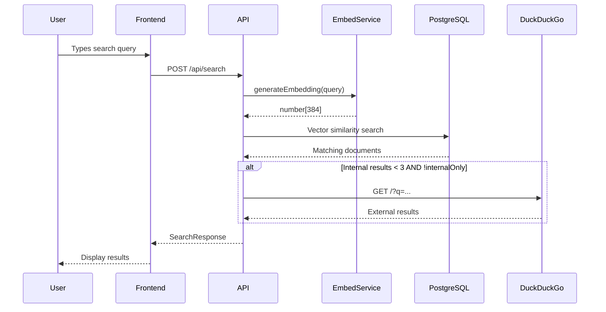
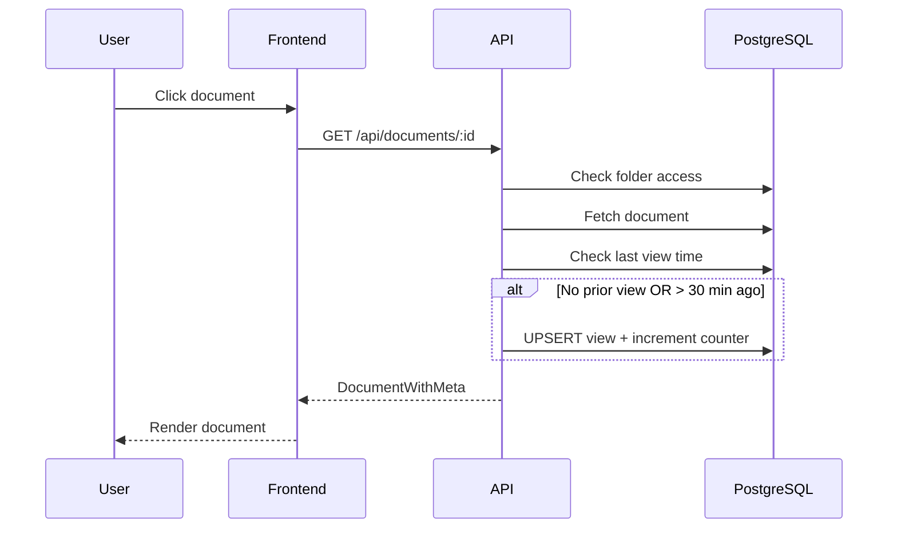
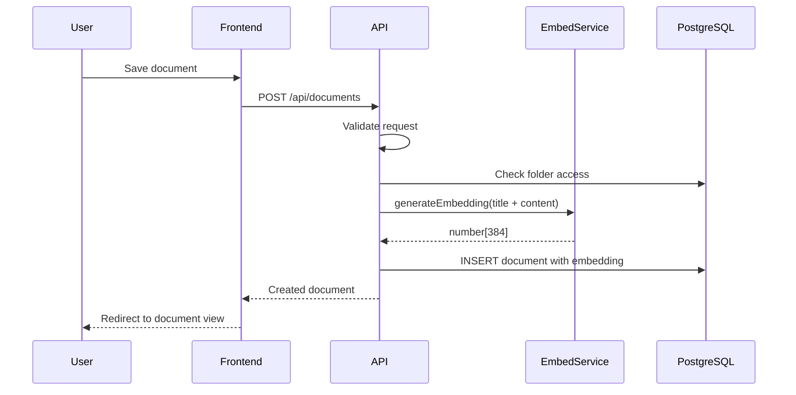

# Core Workflows

## Natural Language Search Flow

```mermaid
sequenceDiagram
    participant User
    participant Frontend
    participant API
    participant EmbedService
    participant PostgreSQL
    participant DuckDuckGo

    User->>Frontend: Types search query
    Frontend->>API: POST /api/search
    API->>EmbedService: generateEmbedding(query)
    EmbedService-->>API: number[384]
    API->>PostgreSQL: Vector similarity search
    PostgreSQL-->>API: Matching documents

    alt Internal results < 3 AND !internalOnly
        API->>DuckDuckGo: GET /?q=...
        DuckDuckGo-->>API: External results
    end

    API-->>Frontend: SearchResponse
    Frontend-->>User: Display results
```

## Document View with View Tracking

```mermaid
sequenceDiagram
    participant User
    participant Frontend
    participant API
    participant PostgreSQL

    User->>Frontend: Click document
    Frontend->>API: GET /api/documents/:id
    API->>PostgreSQL: Check folder access
    API->>PostgreSQL: Fetch document
    API->>PostgreSQL: Check last view time

    alt No prior view OR > 30 min ago
        API->>PostgreSQL: UPSERT view + increment counter
    end

    API-->>Frontend: DocumentWithMeta
    Frontend-->>User: Render document
```

## Document Creation with Embedding

```mermaid
sequenceDiagram
    participant User
    participant Frontend
    participant API
    participant EmbedService
    participant PostgreSQL

    User->>Frontend: Save document
    Frontend->>API: POST /api/documents
    API->>API: Validate request
    API->>PostgreSQL: Check folder access
    API->>EmbedService: generateEmbedding(title + content)
    EmbedService-->>API: number[384]
    API->>PostgreSQL: INSERT document with embedding
    API-->>Frontend: Created document
    Frontend-->>User: Redirect to document view
```

---
