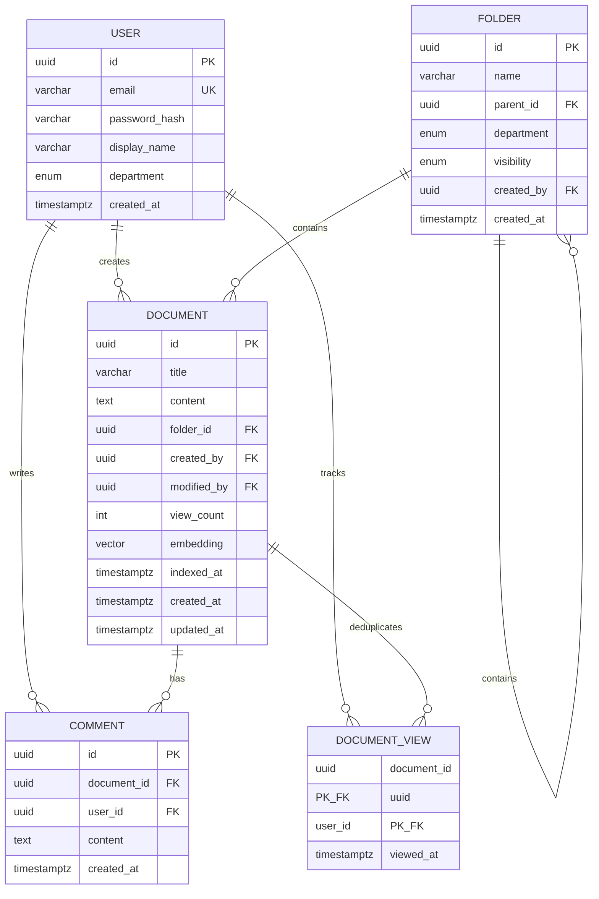

# Data Models

## Summary of Models

| Model | Purpose | Key Fields |
|-------|---------|------------|
| **User** | Authenticated users | id, email, passwordHash, displayName, department |
| **Folder** | Hierarchical organization | id, name, parentId, department, visibility |
| **Document** | Markdown content + metadata | id, title, content, folderId, viewCount, embedding |
| **Comment** | Document feedback | id, documentId, userId, content |
| **DocumentView** | Deduplication tracking only | documentId, userId, viewedAt (composite PK) |

## User

```typescript
// packages/shared/src/types/user.ts

export enum Department {
  FRONTEND = 'frontend',
  BACKEND = 'backend',
  SALES = 'sales',
  HR = 'hr',
  PRODUCT = 'product',
}

export interface User {
  id: string;
  email: string;
  displayName: string;
  department: Department;
  createdAt: Date;
}

// Backend-only, never sent to frontend
export interface UserWithPassword extends User {
  passwordHash: string;
}

// For API responses (excludes sensitive data)
export type PublicUser = Pick<User, 'id' | 'displayName' | 'department'>;
```

## Folder

```typescript
// packages/shared/src/types/folder.ts

export type FolderVisibility = 'public' | 'department';

export interface Folder {
  id: string;
  name: string;
  parentId: string | null;
  department: Department | null;
  visibility: FolderVisibility;
  createdBy: string;
  createdAt: Date;
}

export interface FolderWithMeta extends Folder {
  documentCount: number;
  isAccessible: boolean;
  children?: FolderWithMeta[];
}

export interface FolderTreeNode {
  id: string;
  name: string;
  parentId: string | null;
  visibility: FolderVisibility;
  department: Department | null;
  documentCount: number;
  isAccessible: boolean;
  children: FolderTreeNode[];
}
```

## Document

```typescript
// packages/shared/src/types/document.ts

export interface Document {
  id: string;
  title: string;
  content: string;
  folderId: string;
  createdBy: string;
  modifiedBy: string | null;
  viewCount: number;
  createdAt: Date;
  updatedAt: Date;
}

export interface DocumentWithMeta extends Document {
  commentCount: number;
  createdByUser: PublicUser;
  modifiedByUser: PublicUser | null;
  folderPath: string;
}

export interface DocumentSummary {
  id: string;
  title: string;
  folderId: string;
  folderPath: string;
  createdBy: PublicUser;
  updatedAt: Date;
  viewCount: number;
  commentCount: number;
}

export interface SearchResult {
  document: DocumentSummary;
  snippet: string;
  similarityScore: number;
  matchHighlights: string[];
}
```

## Comment

```typescript
// packages/shared/src/types/comment.ts

export interface Comment {
  id: string;
  documentId: string;
  userId: string;
  content: string;
  createdAt: Date;
}

export interface CommentWithAuthor extends Comment {
  author: PublicUser;
}
```

## DocumentView

```typescript
// packages/shared/src/types/document-view.ts

// Used only for 30-minute deduplication
// Composite primary key: (documentId, userId)
export interface DocumentView {
  documentId: string;
  userId: string;
  viewedAt: Date;
}
```

## Entity Relationship Diagram



---
