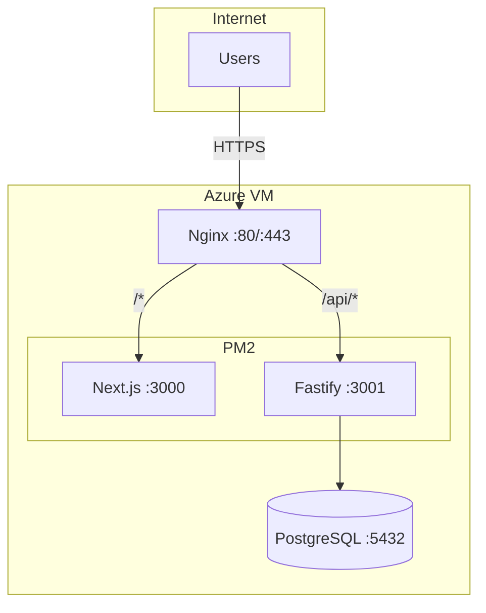

# Deployment Architecture

## Server Architecture (Azure VM)



## Server Setup

```bash
# Install dependencies
sudo apt update && sudo apt upgrade -y
curl -fsSL https://deb.nodesource.com/setup_20.x | sudo -E bash -
sudo apt install -y nodejs nginx postgresql postgresql-16-pgvector
sudo npm install -g pnpm@latest pm2
```

## PM2 Configuration

```javascript
// ecosystem.config.js
module.exports = {
  apps: [
    {
      name: 'simpleconf-api',
      cwd: '/var/www/simpleconf/apps/api',
      script: 'dist/index.js',
      instances: 1,
      env: { NODE_ENV: 'production', PORT: 3001 },
      env_file: '/var/www/simpleconf/apps/api/.env',
    },
    {
      name: 'simpleconf-web',
      cwd: '/var/www/simpleconf/apps/web',
      script: 'node_modules/.bin/next',
      args: 'start -p 3000',
      instances: 1,
      env: { NODE_ENV: 'production', PORT: 3000 },
    },
  ],
};
```

## Nginx Configuration

```nginx
# /etc/nginx/sites-available/simpleconf
server {
    listen 80;
    server_name simpleconf.yourdomain.com;
    return 301 https://$server_name$request_uri;
}

server {
    listen 443 ssl http2;
    server_name simpleconf.yourdomain.com;

    ssl_certificate /etc/letsencrypt/live/simpleconf.yourdomain.com/fullchain.pem;
    ssl_certificate_key /etc/letsencrypt/live/simpleconf.yourdomain.com/privkey.pem;

    # API routes
    location /api/ {
        proxy_pass http://127.0.0.1:3001;
        proxy_http_version 1.1;
        proxy_set_header Upgrade $http_upgrade;
        proxy_set_header Connection 'upgrade';
        proxy_set_header Host $host;
        proxy_set_header X-Real-IP $remote_addr;
        proxy_set_header X-Forwarded-For $proxy_add_x_forwarded_for;
        proxy_set_header X-Forwarded-Proto $scheme;
    }

    # Frontend routes
    location / {
        proxy_pass http://127.0.0.1:3000;
        proxy_http_version 1.1;
        proxy_set_header Upgrade $http_upgrade;
        proxy_set_header Connection 'upgrade';
        proxy_set_header Host $host;
        proxy_set_header X-Real-IP $remote_addr;
        proxy_set_header X-Forwarded-For $proxy_add_x_forwarded_for;
        proxy_set_header X-Forwarded-Proto $scheme;
    }
}
```

## Deployment Script

```bash
#!/bin/bash
# deploy.sh
set -e
APP_DIR="/var/www/simpleconf"
cd $APP_DIR

echo "Pulling latest changes..."
git pull origin main

echo "Installing dependencies..."
pnpm install --frozen-lockfile

echo "Running migrations..."
pnpm db:migrate

echo "Building applications..."
pnpm build

echo "Restarting services..."
pm2 restart ecosystem.config.js

echo "Deployment complete!"
```

## Server Management Commands

```bash
# PM2
pm2 status                    # Check status
pm2 logs                      # View logs
pm2 restart all               # Restart all
pm2 monit                     # Real-time monitoring

# Nginx
sudo nginx -t                 # Test config
sudo systemctl reload nginx   # Reload

# PostgreSQL
sudo systemctl status postgresql
```

---
