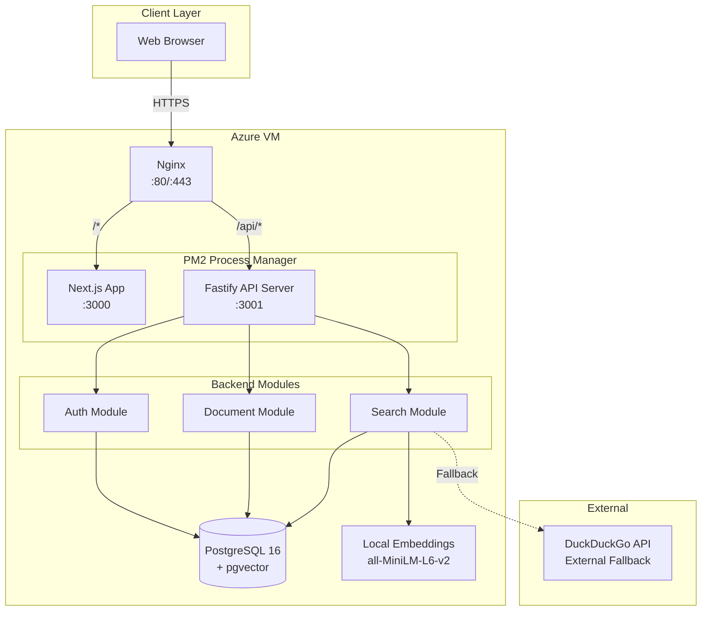

# High Level Architecture

## Technical Summary

SimpleConf follows a **decoupled fullstack architecture** with a Next.js frontend communicating with a standalone Fastify backend via REST APIs. The backend handles all business logic, authentication (JWT), and data persistence in PostgreSQL with pgvector for semantic search. Local embedding generation via `@xenova/transformers` eliminates external API costs. The system deploys on a single Azure VM with Nginx as reverse proxy and PM2 for process management. This separation enables clean concerns while keeping deployment simple.

## Platform and Infrastructure Choice

**Platform:** Single Azure VM with Nginx reverse proxy

**Key Services:**

| Service | Technology | Purpose |
|---------|------------|---------|
| Frontend | Next.js on PM2 | React application server |
| Backend API | Fastify on PM2 | REST API server |
| Database | PostgreSQL 16 + pgvector | Primary data store + vector search |
| Reverse Proxy | Nginx | Route traffic, SSL termination |
| Process Manager | PM2 | Keep Node processes alive |

**Deployment Region:** Single Azure VM (user's existing infrastructure)

## Repository Structure

**Structure:** Monorepo with separate packages

**Monorepo Tool:** pnpm workspaces

**Package Organization:**

```
simple-conf/
├── apps/
│   ├── web/          # Next.js frontend (existing v0.dev code)
│   └── api/          # Fastify backend
├── packages/
│   └── shared/       # Shared TypeScript types
└── docs/             # Project documentation
```

## High Level Architecture Diagram



## Architectural Patterns

- **Decoupled Frontend/Backend:** Next.js serves UI, Fastify serves API — independent processes, clear contracts via REST
  _Rationale:_ Preserves existing frontend, enables independent scaling, follows PRD monolith-with-separation approach

- **Repository Pattern:** Data access abstracted behind repository classes (UserRepository, DocumentRepository, etc.)
  _Rationale:_ Testability, future database migration flexibility, clean separation from route handlers

- **Module-based Backend:** Fastify plugins for Auth, Documents, Search, Comments as encapsulated modules
  _Rationale:_ Clear boundaries, potential future service extraction per PRD NFR7

- **JWT Stateless Auth:** Token-based authentication with no server-side sessions
  _Rationale:_ Scalability, simplicity, standard approach for REST APIs

- **Local Embedding Pipeline:** Document embeddings generated on-server using `@xenova/transformers`
  _Rationale:_ Zero external API costs, fast inference (~50-200ms), privacy (no data leaves server)

---
